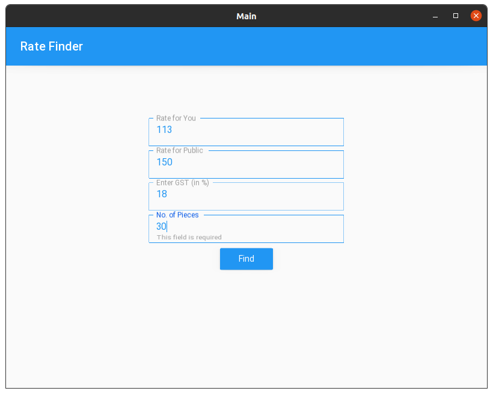
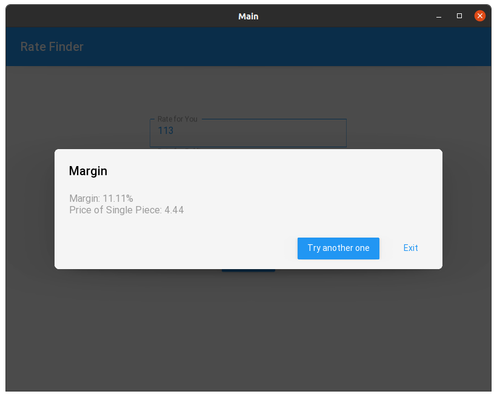

# About
This app is written using Python Language. It is a simple app which finds the Margin Percentage and Price of a single piece for a Product. 

It uses Kivy and KivyMD libraries for the Graphical Interface.
  

---

# Usage
You can run this app via Terminal or compile the Android Package for the Phone.  

---
 
# Building
You can build this app for Android using Buildozer.  

Steps for Building the App:

 1. Install Buildozer from pip.
    

 2. Create the spec file using ~ 'buildozer init'.
  

 3. Edit the spec file generated according to your needs.
  

 4. Build the app using ~ 'buildozer -v android debug'.

 5. It would take around 10-15 minutes for the first time, depending on your PC Specs.
  

 6. Once compiled successfully, you'll see an apk file generated in the bin folder.
  

---
# Screenshots

